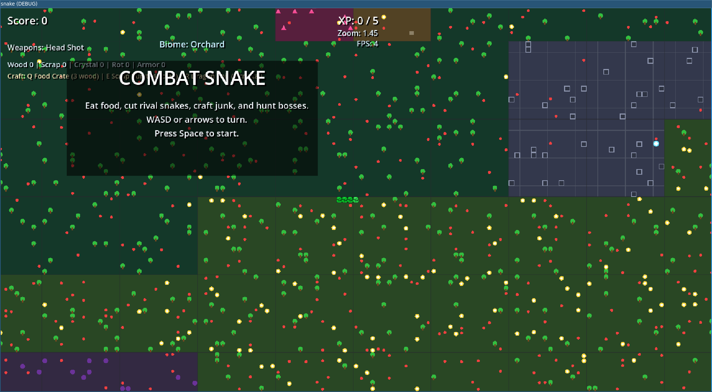

# Snake-gd

Small Godot prototype for making a version of Snake with my brother.

## Archive Note

This repo is archived and unfinished. The current git history was re-initialized on **March 10, 2026** during an archival pass, but the actual project files date the original prototype work to **July 10, 2024**.

What is here:

- a lightweight Godot project
- scenes, scripts, and a small asset set
- an early Snake prototype that later turned into a much weirder combat/slither experiment

The March 2026 pass pushed it much further than the original toy:

- larger biome-based world chunks
- enemy snakes and named bosses
- food/XP/upgrades
- simple crafting/resources
- multiple weapon behaviors and upgrade paths

It is now a fun experiment, but it is still not something I would keep scaling in Godot. The prototype is useful for design discovery, but the long-term direction would probably be a rewrite in C+- if the idea were ever taken seriously.

See:

- [docs/combat-snake.md](docs/combat-snake.md)
- [docs/expansion-roadmap.md](docs/expansion-roadmap.md)

## Structure

- [project.godot](project.godot)
- [scenes](scenes)
- [scripts](scripts)
- [assets](assets)

## Screenshot

